# PROBLEM SOLVING AND PROGRAMMING LANGUAGES (CSC 700) ASSIGNMENT
A documentation of all programmimplementations in the course of the class.

### Imlementation of If Statement
Below is a program that calcuates the premium due to a driver with respect to the driver's age availability of an outstanding ticket.
````
#include <iostream>
using namespace std;

int main()
{
double premiumDue = 75.32;
int driverAge, numTickets;
cout<<"Enter the age of the driver ";
cin>>driverAge;
cout<<"Enter traffic ticket issued ";
cin>>numTickets;

if(driverAge < 26)
premiumDue += 100;
if(driverAge > 50)
premiumDue -=50;
if(numTickets == 2)
premiumDue += 60.25;
cout<<"The premium due is "<<premiumDue<<endl;

return 0;
}
````

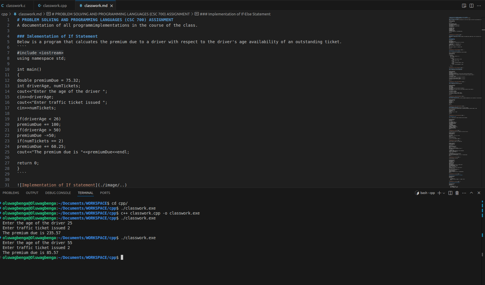

### Implementation of If-Else Statement
The program is a demostration of if-else statement. The program take in gender code, 'M/m' for male and F/f for female. After which premium a assigned and displayed based on gender.

````
#include <iostream>
using namespace std;

int main() {
    char genderCode;
    double premium = 99.95;

    cout << "Enter F or f for female and M or m for male: ";
    cin >> genderCode;

    if (genderCode == 'M' || genderCode == 'm') {
        premium += 40;
        cout << "Male premium is " << premium << endl;
    } else {
        cout << "Female premium is " << premium << endl;
    }

    return 0;
}
````
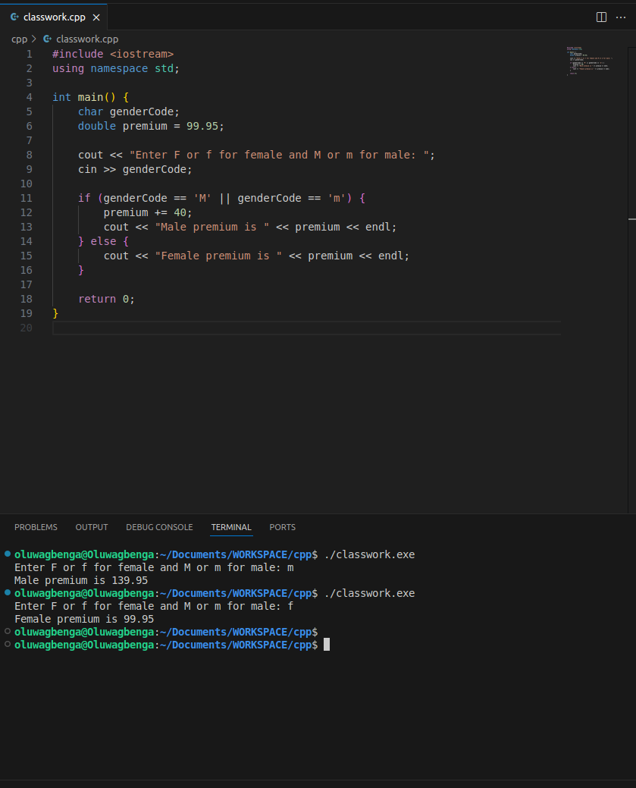

### Implementation if Switch Statement

This is a programmatically implementation of Switch statemet.
````
#include <iostream>
using namespace std;

int main() {
    int choice;
    cout << "Enter a number (1-3): ";
    cin >> choice;

    switch (choice) {
        case 1:
            cout << "Human Resources" << endl;
            break;
        case 2:
            cout << "Sales" << endl;
            break;
        case 3:
            cout << "Information Systems" << endl;
            break;
        default:
            cout << "No such department" << endl;
    }

    return 0;
}
````
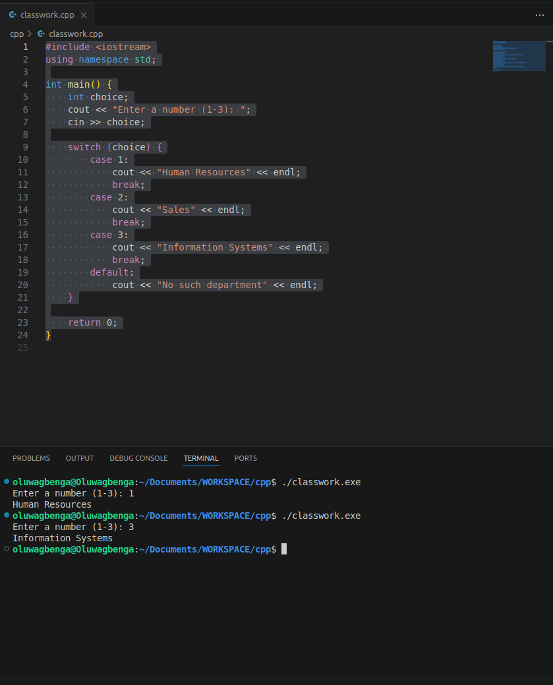

### Implementation of Logical AND expression
This is a demostration of the the Logical AND

````
#include <iostream>
using namespace std;

int main() {
    int numVisits, annualSpent;

    cout << "Kindly input the number of times you have visited the selected location: ";
    cin >> numVisits;

    cout << "To check discount eligibility, please confirm the amount you spent annually: ";
    cin >> annualSpent;

    if (annualSpent >= 1000 && numVisits >= 5) {
        cout << "Congratulations! You are eligible for a discount." << endl;
    } else {
        cout << "Sorry, you are not eligible for a discount." << endl;
    }

    return 0;
}
````
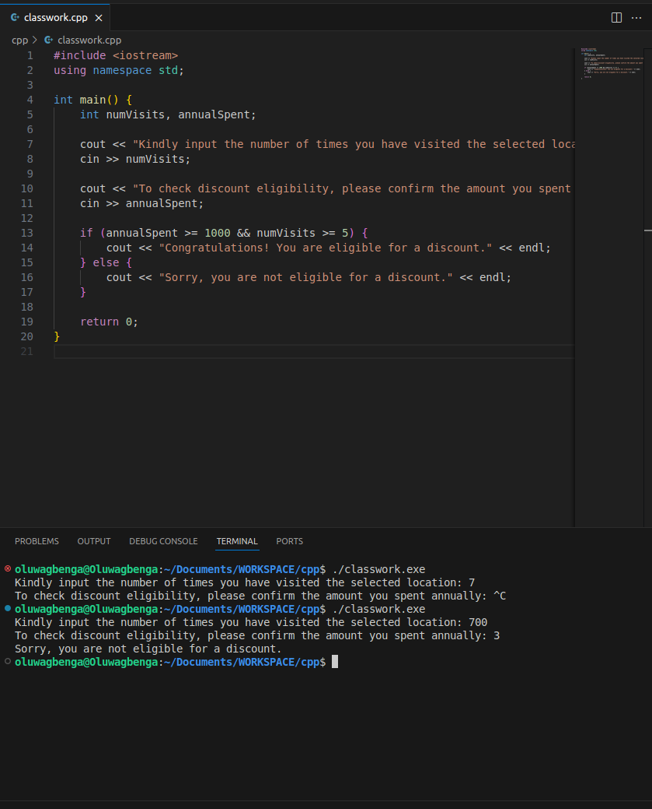

### Implementation of Logical OR
This is a demostration of the the Logical OR

````
#include <iostream.h>
using namespace std;
void main(){
float saleAmt;
char localCode;
count<<"Kindly input the total amount of purchased ";
cin>>saleAmt;
cout<<"Input your area code to allow us verify whether we deliver to your location ";
cin>>localCode;

if(localCode == areaCode)
cout<<"Delivery available";

if(localCode == areaCode || saleAmt >= 500)
cout<<"Delivery is avilable in your location";

return 0;
}
````
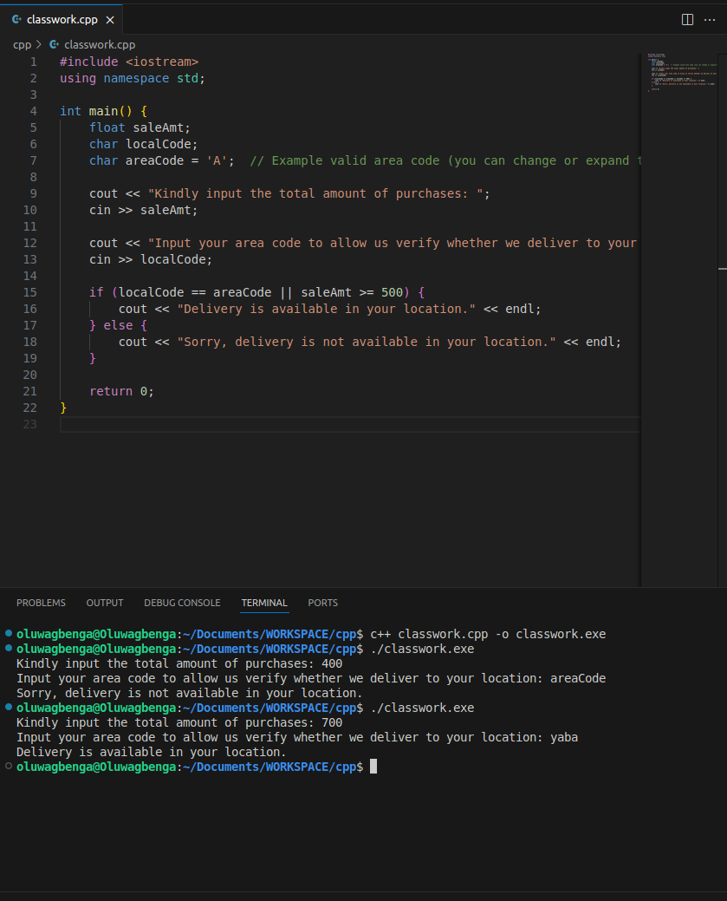

### Implementatioin of While Loop
Loops provide a mechanism with which to perform statements repeatedly and, just as important, to stop that performance when warranted

````
#include <iostream.h>
using namespace std;
int main(){
int count = 1;
while(count < 5){
cout<<count;
++count;
}
return 0;
}
````
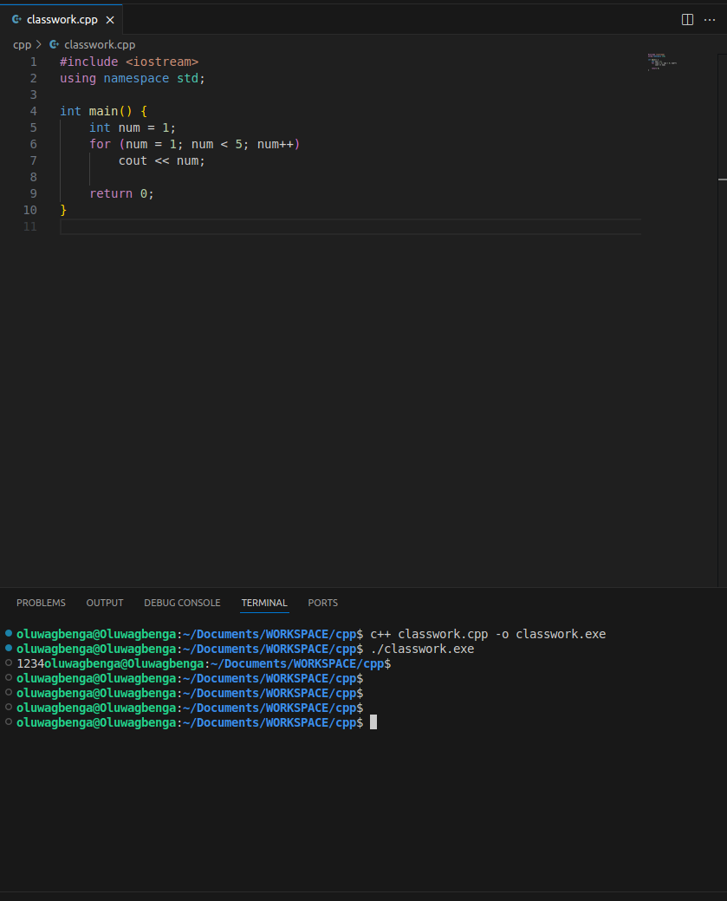

### Implementatioin of For Loop
The for statement represents an alternative to the while statement
It is most often used in a definite loop, or a loop that must execute a definite number of times
````
#include <iostream.h>
using namespace std;
int main(){
int num = 1;
for(num = 1; num < 5; ++num)
cout<<num;

return 0;
}
````


### Implementation Array

This is a demostration of single variables and array variables.

````
#include <iostream>
using namespace std;

int main() {
    int singleInt = 52;
    int arrayInt[5] = {12, 36};

    cout << singleInt << endl;
    cout << arrayInt[0] << endl;

    ++singleInt;
    ++arrayInt[0];

    cout << singleInt << endl;
    cout << arrayInt[0] << endl;

    singleInt = singleInt * 2;
    arrayInt[0] = arrayInt[0] * 2;

    cout << singleInt << endl;
    cout << arrayInt[0] << endl;

    return 0;
}
````
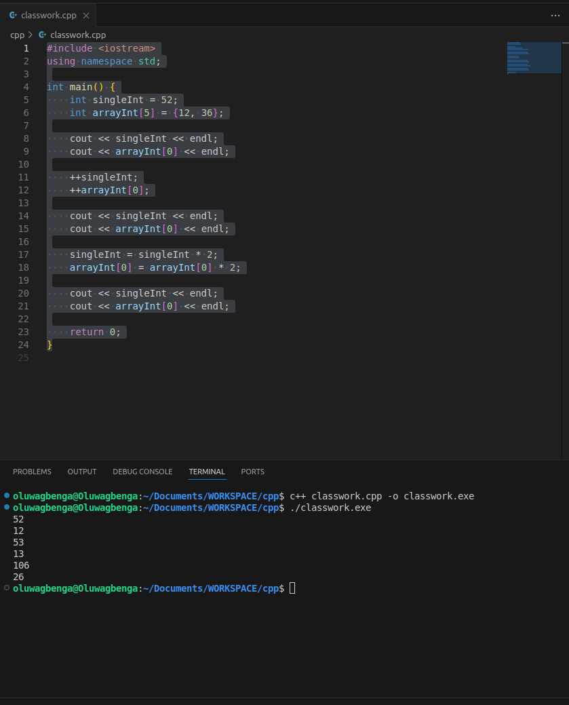

### The pragram below prints out all elements in an array of five [5].

````
#include <iostream>
using namespace std;

int main() {
    int arrayInt[5] = {34, 56, 12, 3, 99};
    int x;

    for (x = 0; x < 5; ++x)
        cout << arrayInt[x] << endl;

    return 0;
}
````
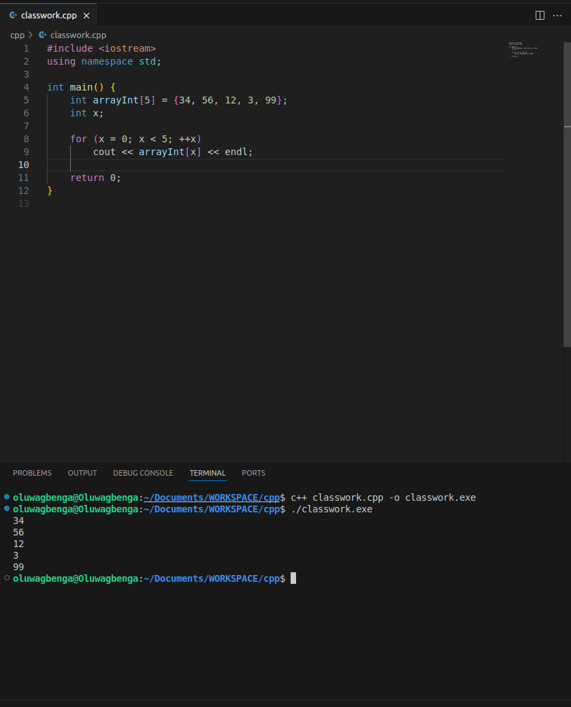

### Using a Constant to Refer to an Array’s Size

````
#include <iostream>
using namespace std;

int main() {
    const int arraySize = 12;
    double sales[arraySize];
    double sale[arraySize];  // Declare sale array for storing commissions
    int a;

    // Input loop
    for(a = 0; a < arraySize; ++a) {
        cout << "Enter sales for salesperson #" << a + 1 << ": ";  // Prompt user properly
        cin >> sales[a];
    }

    // Arithmetic loop: compute 8 percent commission for each salesperson
    for(a = 0; a < arraySize; ++a) {
        sale[a] = sales[a] * 0.08;
    }

    // Output loop: print commission for each salesperson
    for(a = 0; a < arraySize; ++a) {
        cout << "Commission for salesperson #" << a + 1 << " is " << sale[a] << endl;
    }

    return 0;
}
````
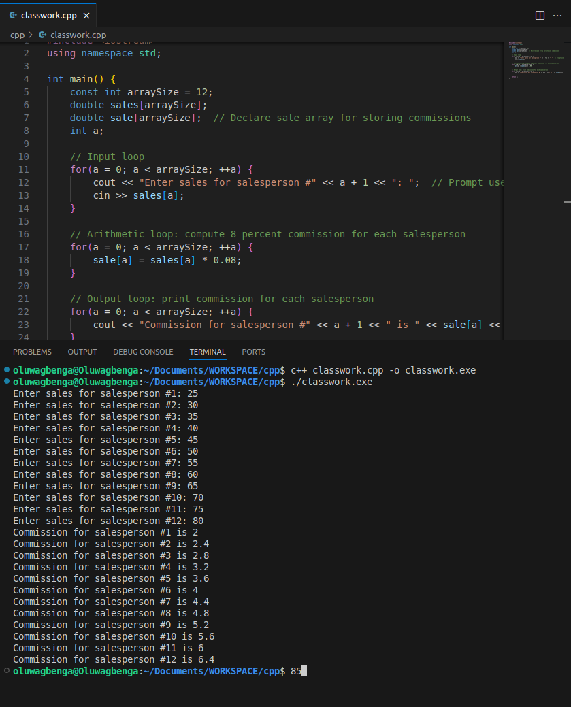

### Accessing Elements in an Array

````
#include <iostream>
using namespace std;

int main() {
    int testScore[30];
    int test = 0, a;
    double total = 0, average;

    cout << "Enter first test score, or 999 to quit: ";
    cin >> testScore[test];

    while (testScore[test] != 999 && test < 30) {
        total += testScore[test];
        ++test;
        if (test < 30) {
            cout << "Enter next test score or 999 to quit: ";
            cin >> testScore[test];
        }
    }

    cout << "\nThe entered test scores are: ";
    for (a = 0; a < test; ++a)
        cout << testScore[a] << " ";
    
    cout << endl;

    if (test > 0) {
        average = total / test;
        cout << "The average test score is: " << average << endl;
    } else {
        cout << "No valid test scores entered." << endl;
    }

    return 0;
}
````
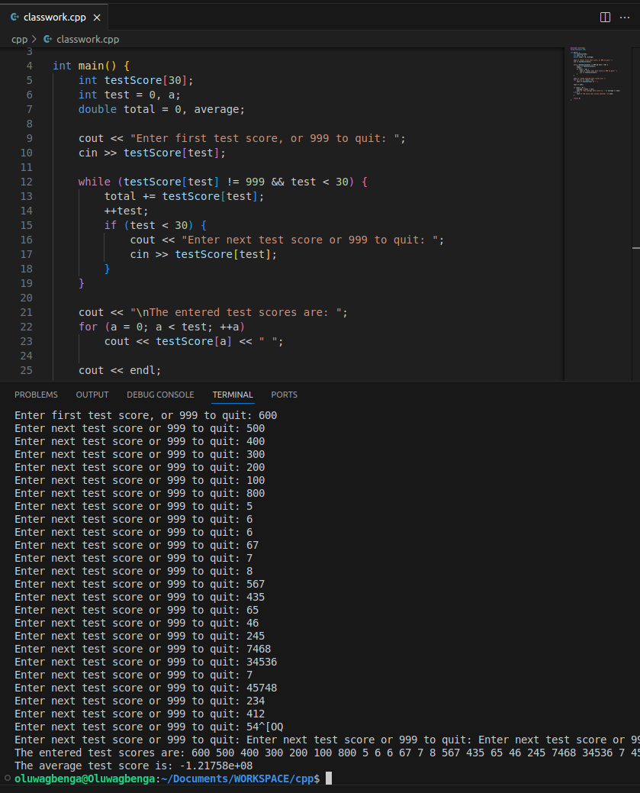

### Displaying Value and Address of a Variable
````
#include<iostream.h>
#include<conio.h>
void main()
{
    int myAge = 21;
    cout << "The value of myAge is " << myAge << endl;
    getch();
}
````
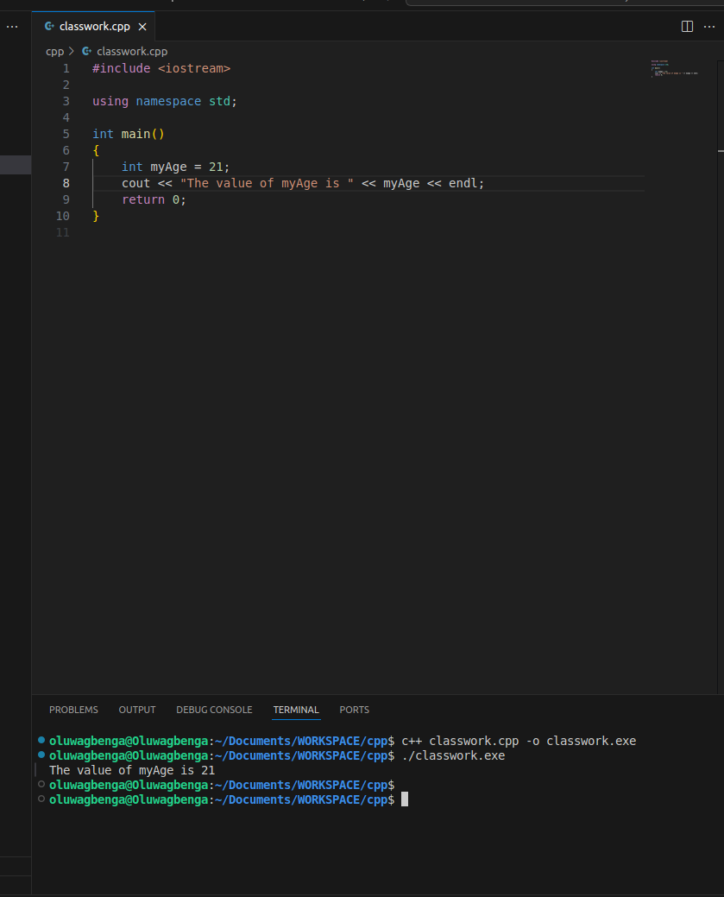

### Using Single and Array Variables
````
#include <iostream>
using namespace std;

int main() {
    int singleInt = 52;
    int arrayInt[5] = {12, 36};  // The rest of the array elements will be initialized to 0

    cout << singleInt << endl;
    cout << arrayInt[0] << endl;

    ++singleInt;
    ++arrayInt[0];

    cout << singleInt << endl;
    cout << arrayInt[0] << endl;

    singleInt = singleInt * 2;
    arrayInt[0] = arrayInt[0] * 2;

    cout << singleInt << endl;
    cout << arrayInt[0] << endl;

    return 0;
}

````
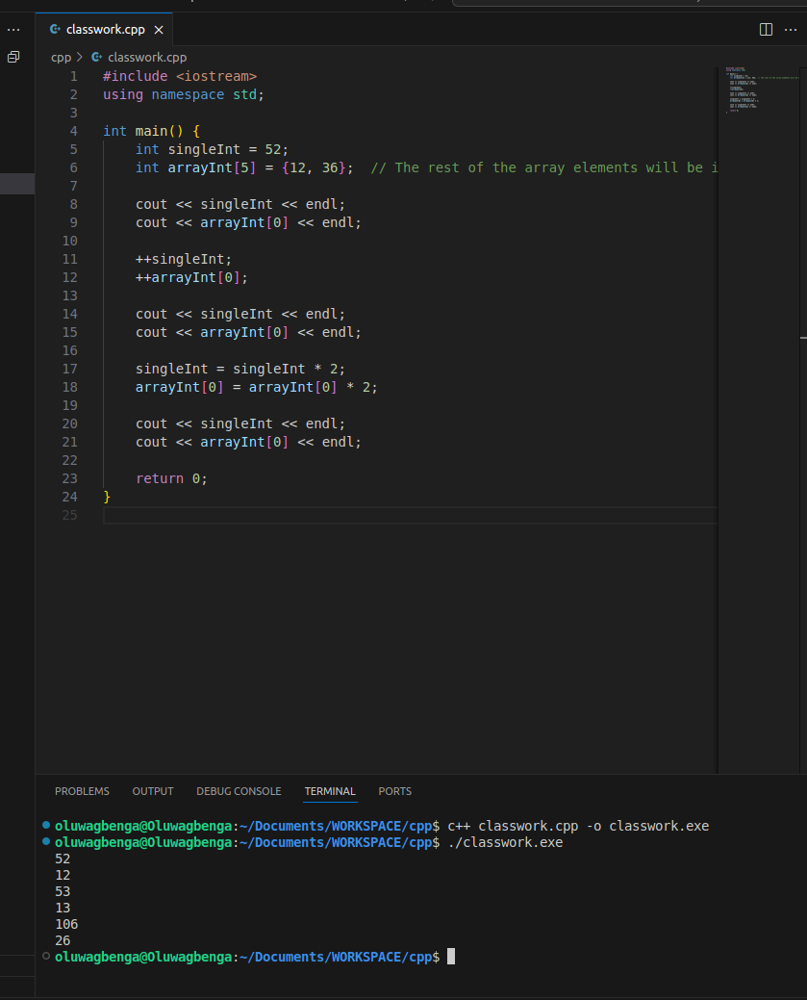

### Using a Constant to Control Loops

````
##include <iostream>
using namespace std;

int main() {
    const int arraySize = 12;
    double sales[arraySize];
    double sale[arraySize];  // Declare sale array for storing commissions
    int a;

    // Input loop
    for(a = 0; a < arraySize; ++a) {
        cout << "Enter sales for salesperson #" << a + 1 << ": ";  // Prompt user properly
        cin >> sales[a];
    }

    // Arithmetic loop: compute 8 percent commission for each salesperson
    for(a = 0; a < arraySize; ++a) {
        sale[a] = sales[a] * 0.08;
    }

    // Output loop: print commission for each salesperson
    for(a = 0; a < arraySize; ++a) {
        cout << "Commission for salesperson #" << a + 1 << " is " << sale[a] << endl;
    }

    return 0;
}
````


### Test Score Average Calculation
````
#include <iostream>
using namespace std;

int main() {
    int testScore[30];
    int test = 0, a;
    double total = 0, average;

    cout << "Enter first test score, or 999 to quit: ";
    cin >> testScore[test];

    while (testScore[test] != 999 && test < 30) {
        total += testScore[test];
        ++test;
        if (test < 30) {
            cout << "Enter next test score or 999 to quit: ";
            cin >> testScore[test];
        }
    }

    cout << "\nThe entered test scores are: ";
    for (a = 0; a < test; ++a)
        cout << testScore[a] << " ";
    
    cout << endl;

    if (test > 0) {
        average = total / test;
        cout << "The average test score is: " << average << endl;
    } else {
        cout << "No valid test scores entered." << endl;
    }

    return 0;
}
````


### Determining Insurance Premiums
````
#include <iostream>
using namespace std;

int main() {
    double premium[4] = {49.95, 76.25, 93.55, 102.95};
    int dependents;

    cout << "How many dependents do you have? ";
    cin >> dependents;

    if (dependents > 3)
        dependents = 3;

    cout << "Your premium is $" << premium[dependents] << endl;

    return 0;
}
````
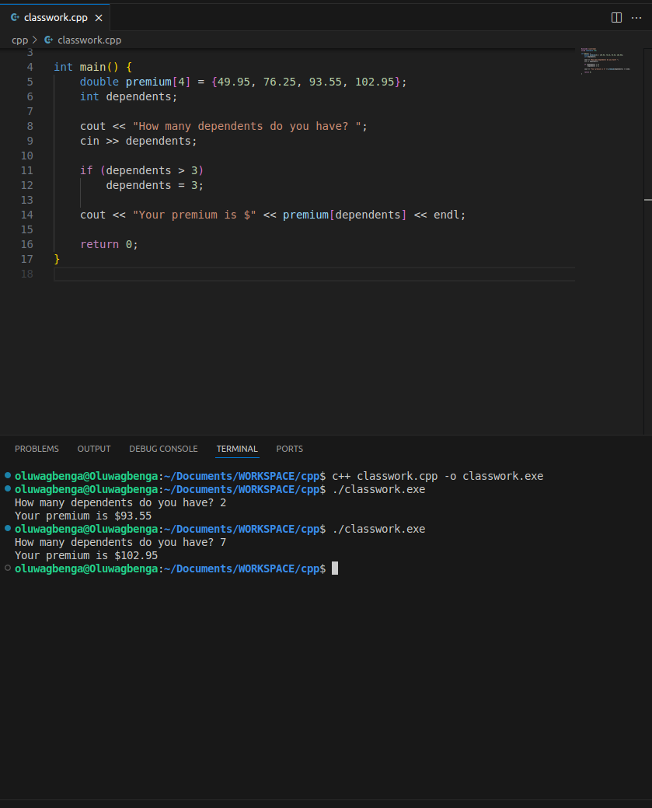

### Part Prices Lookup
````
#include <iostream>
using namespace std;

int main() {
    const int arraySize = 4;
    int partNum[arraySize] = {210, 312, 367, 456};
    double partPrice[arraySize] = {1.29, 2.45, 5.99, 1.42};

    int neededPart, x;
    bool found = false;

    cout << "Enter the part number you want: ";
    cin >> neededPart;

    for (x = 0; x < arraySize; ++x) {
        if (neededPart == partNum[x]) {
            cout << "The price is $" << partPrice[x] << endl;
            found = true;
            break;
        }
    }

    if (!found)
        cout << "Part not found." << endl;

    return 0;
}
````
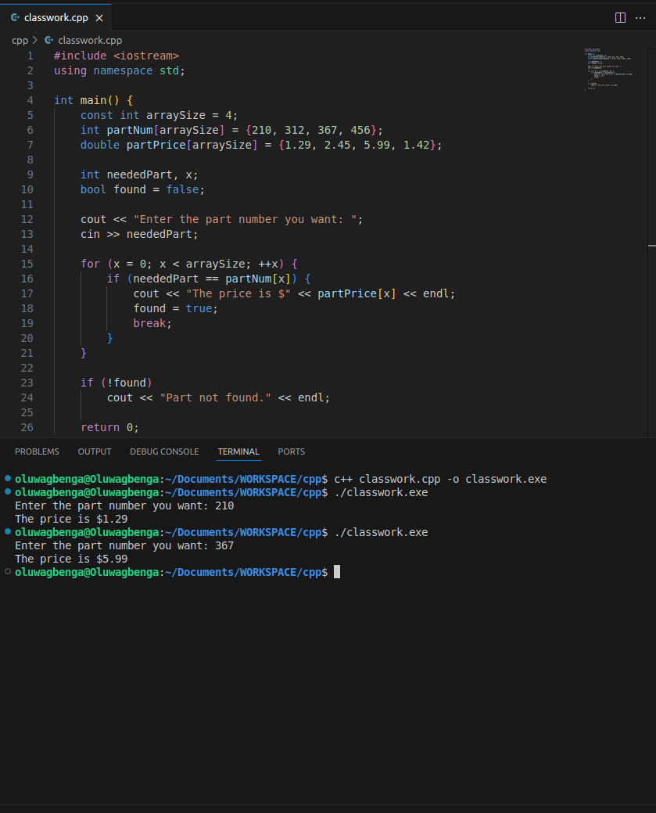

### Pointer Manipulations
````
#include <iostream>
using namespace std;

int main() {
    int sales[7] = {500, 300, 450, 200, 525, 800, 1000};
    int* p = sales;

    // Using array indexing
    for (int x = 0; x < 7; ++x)
        cout << "$" << sales[x] << " ";
    cout << endl;

    // Using pointer as array
    for (int x = 0; x < 7; ++x)
        cout << "$" << p[x] << " ";
    cout << endl;

    // Using pointer arithmetic on array name
    for (int x = 0; x < 7; ++x)
        cout << "$" << *(sales + x) << " ";
    cout << endl;

    // Using pointer arithmetic on pointer
    for (int x = 0; x < 7; ++x)
        cout << "$" << *(p + x) << " ";
    cout << endl;

    return 0;
}
````
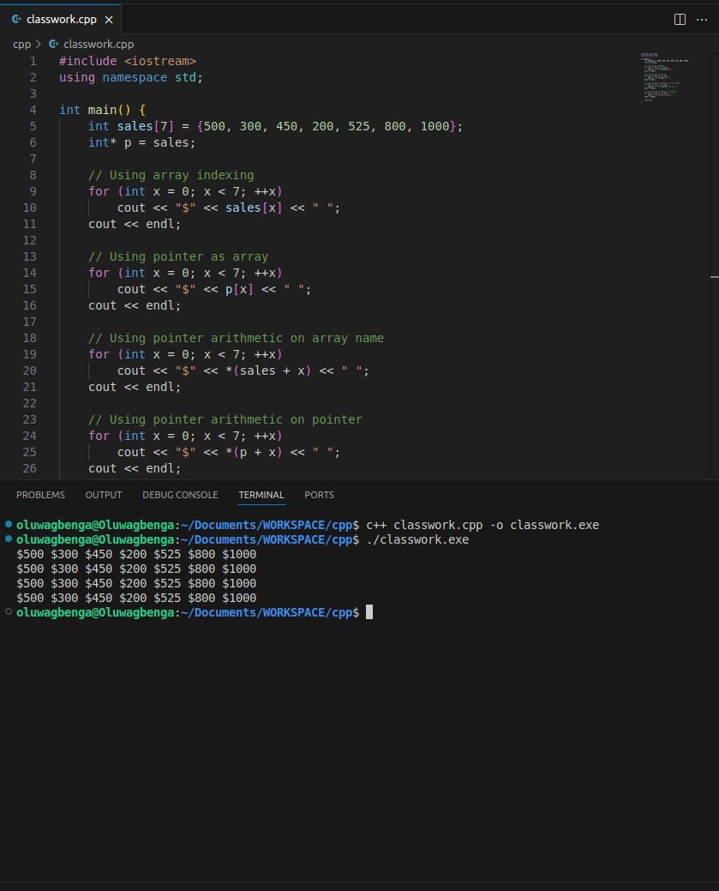